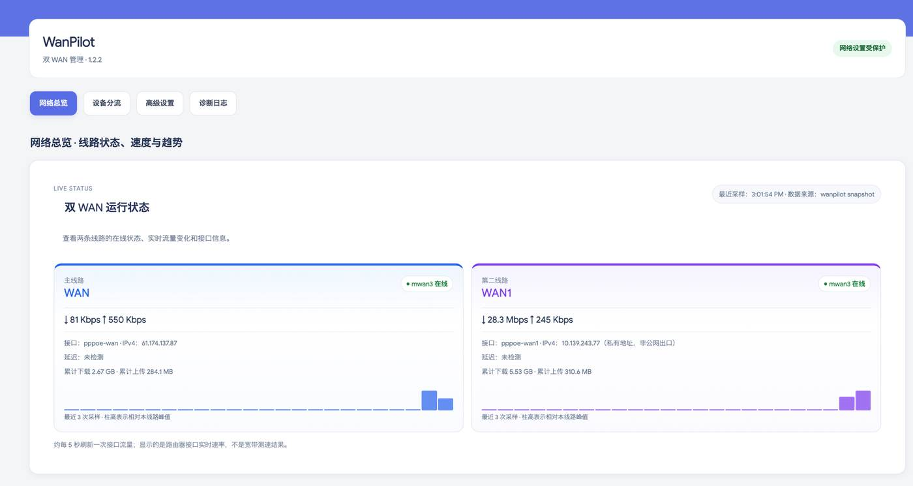
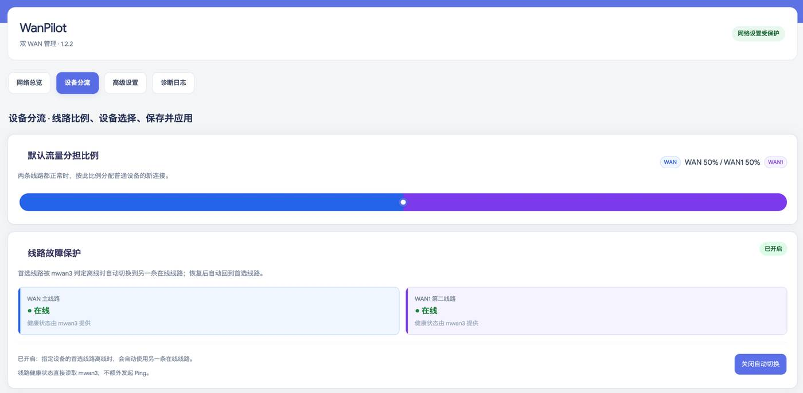
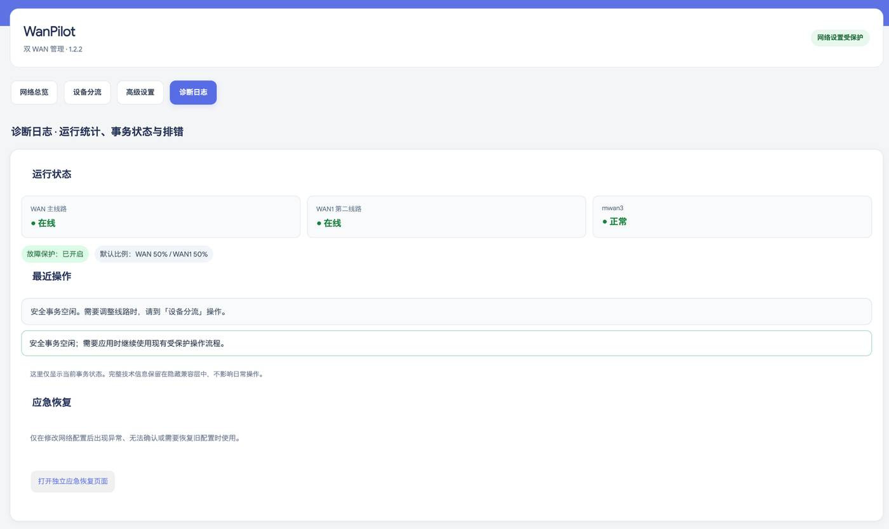
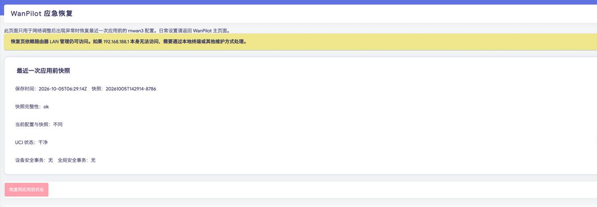

# WanPilot

[中文说明](#中文说明) · [English](#english)

WanPilot is a LuCI multi-WAN management interface for **OpenWrt / iStoreOS**, built on top of **mwan3**.

---

## 中文说明

WanPilot 是一个面向 **OpenWrt / iStoreOS** 的 LuCI 双 WAN 管理插件，底层依赖 **mwan3**。

它的目标不是替代 mwan3，而是把日常最常用的双 WAN 操作做得更直观：查看两条线路状态、调整默认流量分担比例、为单独设备指定优先出口、启用故障切换，并通过带自动确认与回滚保护的流程安全应用配置。

### 主要功能

- 双 WAN 实时状态：`wan` / `wan1`
- WAN / WAN1 默认流量比例调整
- 单设备指定上网线路
- 设备级 Failover 故障切换
- 动态“保存并应用”进度状态
- 安全 Apply / Confirm 事务流程
- 应用异常时自动回滚保护
- 只读诊断与设备规则命中统计
- 独立应急恢复页面
- 首次安装时自动识别 WAN 接口（条件允许时）
- 高级设置直接进入原生 mwan3 LuCI 管理器

### 界面截图

#### 网络总览


#### 设备分流与故障保护


#### 设备列表与线路选择


#### 高级设置


#### 诊断日志


#### 应急恢复


### 依赖

- OpenWrt / iStoreOS + LuCI
- `mwan3`
- `luci-app-mwan3`

IPK 已声明这些依赖。如果软件源中存在相应软件包，使用 `opkg` 安装 WanPilot 时会自动处理依赖关系。

### 已测试环境

当前版本主要在以下环境开发和验证：

- iStoreOS 22.03.7
- x86_64
- 双 WAN：`wan` + `wan1`
- mwan3 / firewall4

当前 1.2.5 代码中的设备快捷分流和部分恢复提示仍包含 `192.168.188.0/24` 的环境假设。其他 LAN 网段在完成泛化和测试前，暂不视为正式支持。

Failover 策略生成已经完成配置级验证；当前版本尚未完成正式的物理拔线回归测试。

### 安装

下载最新 IPK 并复制到路由器：

```sh
opkg update
opkg install /tmp/luci-app-wanpilot_1.2.5_all.ipk
```

安装完成后刷新 LuCI 页面，WanPilot 会出现在“网络”相关菜单中。

### 升级

直接安装新版 IPK：

```sh
opkg install /tmp/luci-app-wanpilot_<version>_all.ipk
```

`/etc/config/wanpilot` 被作为配置文件保留，正常升级不会主动覆盖已有配置。

### 安全机制

WanPilot 不把一次网页点击直接视为网络修改成功。受保护的应用流程包含：

1. 应用前恢复快照
2. 安全预检
3. 候选配置 / 配置指纹校验
4. 应用真实 mwan3 配置
5. 连通性与事务状态检查
6. 自动确认
7. 异常时自动回滚

在远程环境使用前，仍建议确保有本地 LAN 或终端恢复方式。

---

## English

WanPilot is a LuCI multi-WAN management interface for **OpenWrt / iStoreOS**, built on top of **mwan3**.

It focuses on a simpler day-to-day workflow for dual-WAN routers: see both lines at a glance, change the default traffic ratio, assign devices to a preferred line, enable failover, and apply changes through a protected transaction with automatic confirmation and rollback protection.

### Features

- Dual-WAN live status for `wan` and `wan1`
- WAN/WAN1 traffic ratio control
- Per-device routing rules
- Failover-aware device routing
- Dynamic **Save & Apply** progress display
- Protected apply / confirm workflow
- Automatic rollback protection when an apply cannot be confirmed
- Read-only diagnostics and rule-hit inspection
- Emergency recovery page
- Automatic WAN interface detection during first installation when possible
- Direct access to the native mwan3 LuCI manager for advanced configuration

### Screenshots

#### Network overview


#### Device routing and failover


#### Device list


#### Advanced settings


#### Diagnostics


#### Emergency recovery


### Requirements

- OpenWrt / iStoreOS with LuCI
- `mwan3`
- `luci-app-mwan3`

The package declares these dependencies, so `opkg` will install them automatically when the configured package repositories provide them.

### Tested environment

The current release was developed and verified primarily on:

- iStoreOS 22.03.7
- x86_64
- dual WAN: `wan` + `wan1`
- mwan3 / firewall4 environment

The current 1.2.5 code still contains assumptions for a `192.168.188.0/24` LAN in the device shortcut workflow and recovery text. Other LAN subnets should be treated as **not yet officially supported** until that logic is generalized and tested.

Failover policy generation has been configuration-validated. Physical WAN cable-disconnect failover has not yet been formally regression-tested for this release.

### Install

Download the latest IPK release and copy it to the router, then run:

```sh
opkg update
opkg install /tmp/luci-app-wanpilot_1.2.5_all.ipk
```

After installation, refresh LuCI in the browser. WanPilot appears under the Network section.

### Upgrade

Install the newer IPK over the existing version:

```sh
opkg install /tmp/luci-app-wanpilot_<version>_all.ipk
```

`/etc/config/wanpilot` is treated as a conffile so an existing configuration is not intentionally replaced during a normal upgrade.

### Safety model

WanPilot does not directly treat a UI click as proof that a network change is safe. The protected apply path uses staged candidate configuration, pre-apply recovery snapshots, transaction state checks, quick health guards, configuration fingerprints and explicit confirmation.

If the protected transaction cannot be confirmed, the rollback mechanism is designed to restore the previous mwan3 configuration.

### Build with the OpenWrt SDK

Place this repository in an OpenWrt SDK/package feed and build it like a normal package:

```sh
make package/luci-app-wanpilot/compile V=s
```

The package metadata declares:

```text
+luci-base +mwan3 +luci-app-mwan3
```

### Source layout

```text
.
├── Makefile
├── htdocs/
│   └── luci-static/resources/view/wanpilot/
├── root/
│   ├── etc/config/wanpilot
│   └── usr/
│       ├── libexec/
│       └── share/
└── LICENSE
```

### Current release

**v1.2.5**

Highlights:

- redesigned device-routing UI
- WAN blue / WAN1 purple visual system
- failover-aware preferred-line policies
- dynamic Save & Apply progress state
- automatic confirmation after protected application
- emergency recovery retained outside the normal operation flow
- package dependency on mwan3

## License

MIT License. See [LICENSE](LICENSE).

## Project status

WanPilot is still evolving. Before using it on a remote-only router, verify that you have a local recovery path and understand your current mwan3 configuration.
